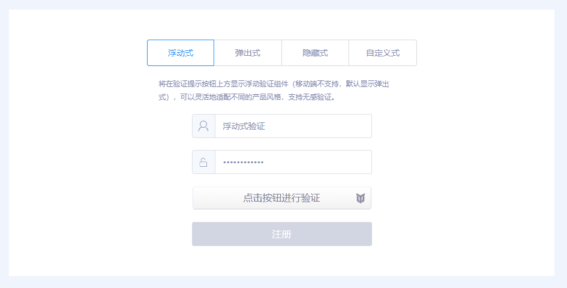
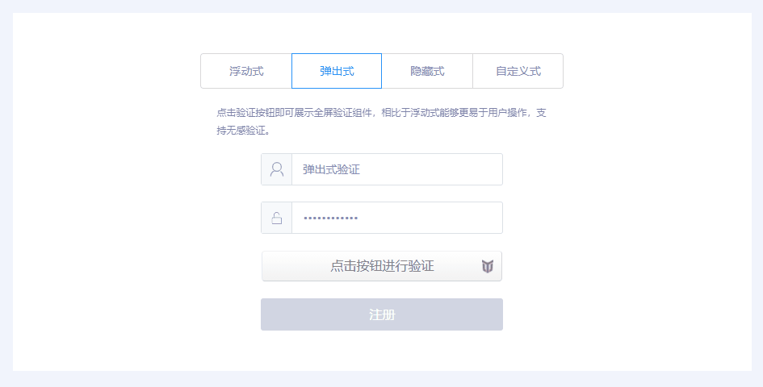
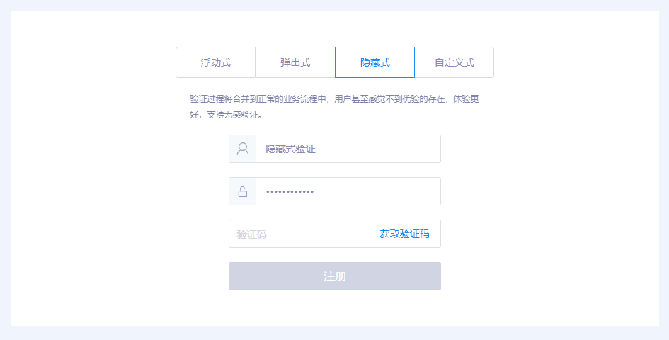
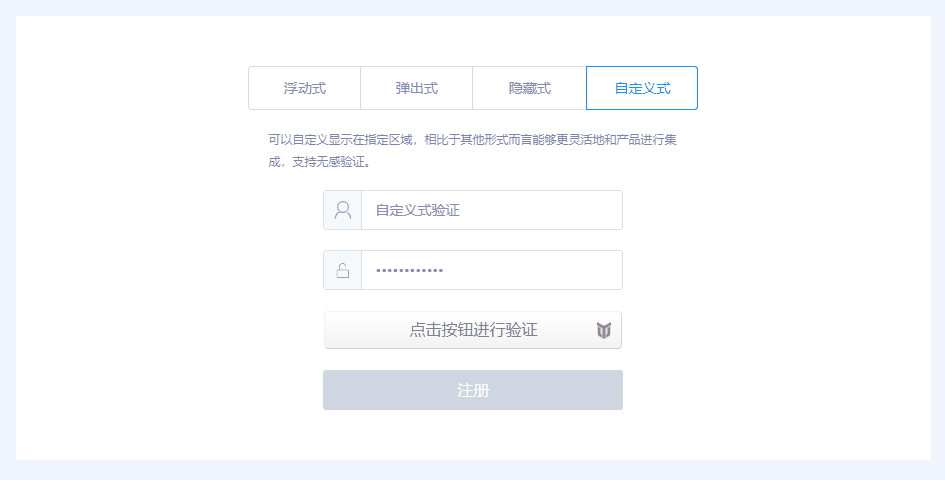

YoTest-Web-SDK 文档
----
<a href="https://www.npmjs.com/package/yotest-web-sdk"></a>

> 基于设备特征识别和操作行为识别的新一代智能验证码，具备智能评分、抗Headless、模拟伪装、针对恶意设备自动提升验证难度等多项安全措施，帮助开发者减少恶意攻击导致的数字资产损失，强力护航业务安全。

* [仓库入口](https://github.com/YoTest-team/YoTest-Web-SDK#%E4%BB%93%E5%BA%93%E5%85%A5%E5%8F%A3)
* [兼容性](https://github.com/YoTest-team/YoTest-Web-SDK#%E5%85%BC%E5%AE%B9%E6%80%A7)
* [安装](https://github.com/YoTest-team/YoTest-Web-SDK#%E5%AE%89%E8%A3%85)
* [快速开始](https://github.com/YoTest-team/YoTest-Web-SDK#%E5%BF%AB%E9%80%9F%E5%BC%80%E5%A7%8B)
* [验证模式](https://github.com/YoTest-team/YoTest-Web-SDK#%E9%AA%8C%E8%AF%81%E6%A8%A1%E5%BC%8F)
* [API](https://github.com/YoTest-team/YoTest-Web-SDK#api)


### 仓库入口：
<a href="https://gitee.com/yo-test-team/yo-test-web-sdk"></a>&nbsp;&nbsp;
<a href="https://github.com/YoTest-team/YoTest-Web-SDK"></a>

### 兼容性
> 以下兼容性根据[BrowserStack](https://live.browserstack.com/)的相关真机测试得出，仅供参考

* IE9+
* Edge 15+
* Chrome 27+
* Safari 7.1+
* Firefox 26+
* Android 4.4+
* iOS Safari 9+

### 安装

> npm install yotest-web-sdk --save

或者你可以在HTML文件中引用CDN路径

```html
<script src="https://cdn.jsdelivr.net/npm/yotest-web-sdk@1.0.4/dist/index.min.js"></script>
```
### 快速开始

当你使用npm进行安装后，你可以通过import直接引入

```javascript
import initYoTest from "yotest-web-sdk";

initYoTest({
  accessId: "当前项目所属的accessId，可以在后台中进行获取及查看",
}, (captcha)=>{
  if(captcha != null){
    captcha.appendTo("#captcha");
  }
});
```

如果你是通过CDN路径引入，那么你也可以轻松的使用此SDK

```html
<!DOCTYPE html>
<html>
  <head>
    <meta charset="UTF-8" />
    <title>YoTest Web SDK Demo</title>
    <style>
      html,
      body {
        width: 100%;
        height: 100%;
      }

      #captcha {
        width: 300px;
        height: 40px;
        position: absolute;
        left: 50%;
        top: 50%;
        -ms-transform: translate(-50%, -50%);
        -webkit-transform: translate(-50%, -50%);
        transform: translate(-50%, -50%);
      }
    </style>
  </head>
  <body>
    <div id="captcha"></div>
    <script>
      initYoTest({
        accessId: "当前项目所属的accessId，可以在后台中进行获取及查看",
      }, (captcha) => {
        if(captcha != null) {
          captcha.appendTo("#captcha");
        }
      });
    </script>
  </body>
</html>
```

### 验证模式

* 浮动式，默认PC展现形式，移动端不支持此模式，展示为弹窗式，设置 product: "float" 时生效



```html
<div id="captcha"></div>
...
<script>
  initYoTest({
    accessId: "your accessId",
    product: "float",
  }, (captcha) => {
    if(captcha) {
      captcha.appendTo("#captcha");
    }
  });
</script>
```

* 弹窗式，设置 product: "popup" 时生效



```html
<div id="captcha"></div>
...
<script>
  initYoTest({
    accessId: "your accessId",
    product: "popup",
  }, (captcha) => {
    if(captcha) {
      captcha.appendTo("#captcha");
    }
  });
</script>
```

* 隐藏式，设置 product: "bind" 时生效，同时需要在onReady之后自行调用 [verify](https://github.com/YoTest-team/YoTest-Web-SDK#captchaprototypeverify) 方法进行展现



```html
<script>
  initYoTest({
    accessId: "your accessId",
    product: "float",
  }, (captcha) => {
    if(captcha) {
      captcha.onReady(() => {
        // 你也可以绑定事件，但需要注意：
        // 一定要在onReady之后进行verify的调用
        captcha.verify();
      });
    }
  });
</script>
```

* 自定义式，设置 product: "custom" 时生效，同时需要设置 [area](https://github.com/YoTest-team/YoTest-Web-SDK#inityotestoption-callback) 参数



```html
<div id="captcha"></div>
...
<script>
  initYoTest({
    accessId: "your accessId",
    product: "custom",
    area: "#form"
  }, (captcha) => {
    if(captcha) {
      captcha.appendTo("#captcha");
    }
  });
</script>
```

### API

初始化函数

* [initYoTest(option, callback)](https://github.com/YoTest-team/YoTest-Web-SDK#inityotestoption-callback)

Captcha实例方法

* [appendTo(selector)](https://github.com/YoTest-team/YoTest-Web-SDK#captchaprototypeappendto)

* [getValidate()](https://github.com/YoTest-team/YoTest-Web-SDK#captchaprototypegetvalidate)

* [reset()](https://github.com/YoTest-team/YoTest-Web-SDK#captchaprototypereset)

* [verify()](https://github.com/YoTest-team/YoTest-Web-SDK#captchaprototypeverify)

* [onReady(callback)](https://github.com/YoTest-team/YoTest-Web-SDK#captchaprototypeonreadycallback)

* [onSuccess(callback)](https://github.com/YoTest-team/YoTest-Web-SDK#captchaprototypeonsuccesscallback)

* [onError(callback)](https://github.com/YoTest-team/YoTest-Web-SDK#captchaprototypeonerrorcallback)

* [onClose(callback)](https://github.com/YoTest-team/YoTest-Web-SDK#captchaprototypeonclosecallback)

* [destroy()](https://github.com/YoTest-team/YoTest-Web-SDK#captchaprototypedestroycallback)

#### initYoTest(option, callback)
  - `option` \<Object\>
    - **accessId** \<String\> 必填，当前项目所属的accessId，可以在优验后台中进行相关获取及查看
    - **product** \<String\> 可选，默认值float，设置验证码的展现形式，其值包括浮动式（float）、弹出式（popup）、绑定式（bind）、自定义式（custom）四种，具体形式可自行通过 [在线体验]() 页面进行选择。需要注意的是，移动端由于屏幕展现原因，是无法展现浮动式（float）的
    - **area** \<String\> 可选，仅当 product: "custom" 生效，其作用为设置验证区域。需要注意的是，请确保对应的DOM元素存在，且符合CSS Selector的规范（例如：#id、.class、tagName及其组合均为合法）
    - **bgColor** \<String\> 可选，仅当 product: "custom" 生效，其设置对应验证区域的背景，支持HEX、RGB及RGBA的颜色格式
    - **enforced** \<Boolean\> 可选，默认值false，强制每一次都进行验证，取消无感验证
  - `callback` \<Function\>
    - **captcha**: \<Captcha\> 加载成功且初始化完成则返回 Captcha 实例，其具有的方法请参考下方文档说明，若加载失败，其返回为 null，请做好错误处理
  - `return:` undefined

初始化 `YoTest` ，传入相关的 `option` 参数，在 `callback` 中将会得到 `YoTest` 的对应实例。

```javascript
initYoTest({
  accessId: "<your project accessId>",
  product: "custom",
  area: "#container",
  bgColor: "#ff0000",
}, function(captcha) {
  if(captcha != null){
    captcha.appendTo("#captcha");
  }
});
```
#### Captcha.prototype.appendTo(selector)
- selector \<String\> 符合 CSS Selector的选择器及其组合（例如：#id、.class等）
- `return`: this

用于将 Captcha 实例添加到页面之中，使其展现默认的优验按钮样式。

```html
<div id="captcha"></div>
...
<script>
  initYoTest({
    accessId: "your accessId"
  }, (captcha) => {
    if(captcha){
      captcha.appendTo("#captcha");
    }
  });
</script>
```

#### Captcha.prototype.getValidate()

- `return`: \<Object\>
  - token \<String\> 当前验证的凭证，需要提交给后端来进行是否通过判断
  - verified \<Boolean\> 是否验证成功

获取当前验证结果。

```html
<div id="captcha"></div>
...
<script>
  initYoTest({
    accessId: "your accessId",
  }, (captcha) => {
    if(!captcha){
      return;
    }

    captcha.appendTo("#captcha");
    captcha.onClose(()=>{
      const { token, verified } = captcha.getValidate();
      if(verified) {
        // 通过fetch方法将token传给后端相应接口进行判断
        fetch("...?token=" + token);
      }
    });
  });
</script>
```

#### Captcha.prototype.reset()
- `return`: this

重置 Captcha 当前状态为初始化状态。

```html
<div id="captcha"></div>
<button id="reset">重置<button>
...

<script>
  initYoTest({
    accessId: "your accessId",
  }, (captcha) => {
    if(!captcha) {
      return;
    }

    captcha.appendTo("#captcha");
    captcha.onReady(() => {
      const $button = document.querySelector("#reset");
      $button.addEventListener("click", () => {
        captcha.reset();
      });
    });
  });
</script>

```

#### Captcha.prototype.verify()
- `return`: this

当 product: "bind" 是，调用此API可以呼出验证界面并要求验证。这种方式提供了更好的灵活性，方便开发者在不破坏原由功能和UI的情况下进行集成。但需要注意的是，请在onReady后进行调用，同时 verify 不需要和 appendTo 方法一同使用。

```html
<button id="checkcode">获取验证码</button>
...
<script>
  initYoTest({
    accessId: "your accessId",
  }, (captcha) => {
    if(!captcha) {
      return;
    }

    captcha.onReady(() => {
      const $checkcode = document.querySelector("#checkcode");
      $checkcode.addEventListener("click", () => {
        captcha.verify();
      });
    });
  });
</script>
```

#### Captcha.prototype.onReady(callback)
- callback \<Function\> 初始化成功的回调函数，无参数
- `return`: this

监听验证的初始化完成事件。

```html
<div id="captcha"></div>
...
<script>
  initYoTest({
    accessId: "your accessId",
  }, (captcha) => {
    if(!captcha) {
      return;
    }

    captcha.appendTo("#captcha");
    captcha.onReady(()=>{
      console.log("yotest init completed...");
    });
  });
</script>
```

#### Captcha.prototype.onSuccess(callback)
- callback \<Function\>
  - data \<Object\> 验证成功的相关数据
    - token \<String\> 当前验证的凭证，需要提交给后端来进行是否通过判断
    - verified \<Boolean\> 是否验证成功
- `return` this

验证成功的监听回调。

```html
<div id="captcha"></div>
...
<script>
  initYoTest({
    accessId: "your accessId",
  }, (captcha) => {
    if(!captcha) {
      return;
    }

    captcha.appendTo("#captcha");
    captcha.onSuccess(({ token, verified }) => {
      console.log(token, verified);
    });
  });
</script>
```

#### Captcha.prototype.onError(callback)

#### Captcha.prototype.onClose(callback)

#### Captcha.prototype.destroy()
